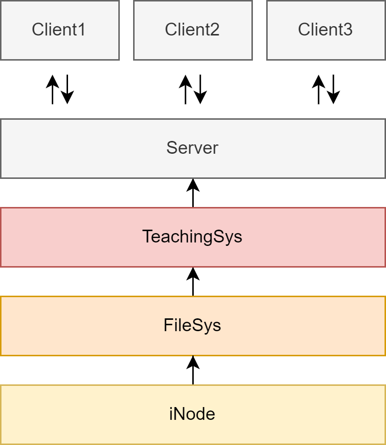
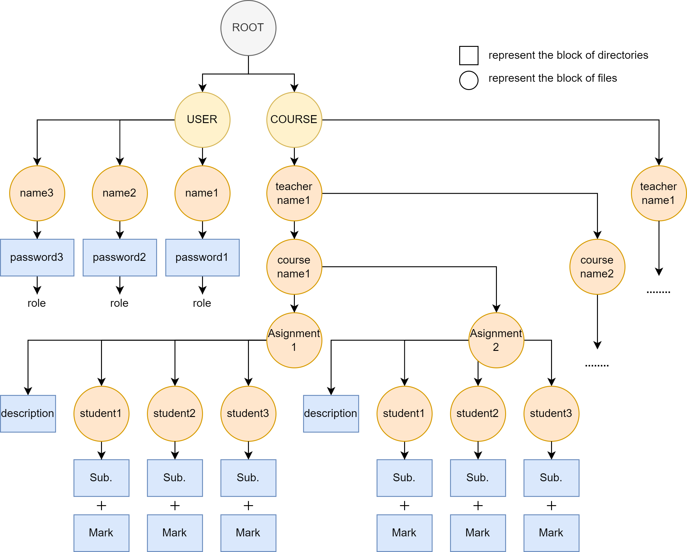

# Student Grade Management System
Course design of Operation System, SCUT, 2023

## Group Info
| Name          | Responsibilities                                       |
|---------------|--------------------------------------------------------|
| Haoquan Zhang | System architecture design, `I-Node` implementation, `FileSystem` implementation, `TeachingSystem` implementation|
| Zhiyu Jiang   | File system extension, documentation writing, slideshow designn |
| Zhizhan Zhang | `Server-Client` communication implementation |
| Xupeng Gu     | `FileSystem` terminal UI, `TeachingSystem` terminal UI |

## Basic Requirements
* The system adopts a `server-client` architecture
* Data is stored on the `server`
* Users access the system through the `client`. 
* Multiple users are allowed to access the system simultaneously.

The system users are divided into three categories:

1. **TEACHER**: Can publish assignments, receive student assignments, and grade assignments. A teacher can teach multiple courses simultaneously.

2. **STUDENT**: Can view assignment content, upload assignments, and obtain course grades. A student can enroll in multiple courses concurrently.

3. **ADMIN**: Possesses both teacher and student functionalities and has the additional capability to create user accounts, as well as backup and restore the system.

The system is built on the principles of basic file management and inter-process communication in the operating system. It employs the `I-Node` file system type and uses `pipes` for inter-process communication. The system is required to implement the following functionalities:

|          | ADMIN | TEACHER | STUDENT |
|----------|--------|------|------|
| 登陆系统 |   √    |  √   |  √   |
| 创建用户 |   √    |  ×   |  ×   |
| 创建文件夹 |  √    |      |      |
| 删除文件夹 |  √    |      |      |
| 列出目录下文件 |  √    |      |      |
| 创建文件 |   √    |      |      |
| 删除文件 |   √    |      |      |
| 读取文件 |   √    |      |      |
| 写入文件 |   √    |      |      |
| 更改访问权限 |  √    |      |      |
| 备份系统 |   √    |  ×   |  ×   |
| 恢复系统 |   √    |  ×   |  ×   |

注意，设计系统时应该注意使用互斥锁对资源进行保护，例如对单个文件进行读写时应当阻止其他用户的访问，管理员对系统进行备份与恢复时，应当阻止其他用户对所有文件的访问。
下面给出系统额外功能的可选参考：
* I-Node 所能容纳的文件块数目有限，当文件大小超出限制时的应对方法。
* 利用 socket 套接口进程间通讯。
* 实现文件快照，相比文件备份，文件快照只记录文件的改动，效率更高，占用空间更小。
* 现实场景中文件系统包含的其他功能，例如密码登录、密码修改、用户删除、文件所属用户更改、文件所属用户组更改等等，学生可自行设计，言之有理即可。