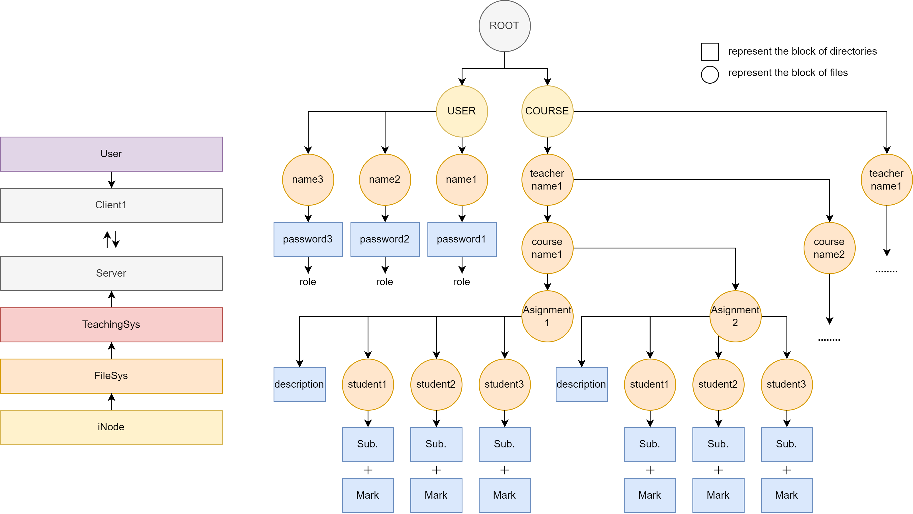

# Student Grade Management System
Course design of Operation System, SCUT, 2023

## Group Info
| Name          | Responsibilities                                       |
|---------------|--------------------------------------------------------|
| Haoquan Zhang | System architecture design, `I-Node` implementation, `FileSystem` implementation, `TeachingSystem` implementation|
| Zhiyu Jiang   | File system extension, documentation writing, slideshow designn |
| Zhizhan Zhang | `Server-Client` communication implementation |
| Xupeng Gu     | `FileSystem` terminal UI, `TeachingSystem` terminal UI |

## Basic Requirements
* The system adopts a `server-client` architecture
* Data is stored on the `server`
* Users access the system through the `client`. 
* Multiple users are allowed to access the system simultaneously.

The system users are divided into three categories:

1. **TEACHER**: Can publish assignments, receive student assignments, and grade assignments. A teacher can teach multiple courses simultaneously.

2. **STUDENT**: Can view assignment content, upload assignments, and obtain course grades. A student can enroll in multiple courses concurrently.

3. **ADMIN**: Possesses both teacher and student functionalities and has the additional capability to create user accounts, as well as backup and restore the system.

The system is built on the principles of basic file management and inter-process communication in the operating system. It employs the `I-Node` file system type and uses `pipes` for inter-process communication. The system is required to implement the following functionalities:

| 操作编号 | 操作描述                    | ADMIN | TEACHER | STUDENT |
|---------|-----------------------------|-------|---------|---------|
| 0       | Exit file system            | ✔️    | ✔️      | ✔️      |
| 1       | List all users              | ✔️    | ✔️      | ✔️      |
| 2       | Show all information        | ✔️    | ❌      | ❌      |
| 3       | Create a User               | ✔️    | ❌      | ❌      |
| 4       | Delete a User               | ✔️    | ❌      | ❌      |
| 5       | Create a course             | ✔️    | ❌      | ❌      |
| 6       | Delete a course             | ✔️    | ❌      | ❌      |
| 7       | Create an assignment        | ✔️    | ✔️      | ❌      |
| 8       | Delete an assignment        | ✔️    | ✔️      | ❌      |
| 9       | Create a submission         | ✔️    | ✔️      | ✔️      |
| 10      | Delete a submission         | ✔️    | ✔️      | ✔️      |
| 11      | Mark a submission           | ✔️    | ✔️      | ❌      |
| 12      | Get course info in list     | ✔️    | ✔️      | ✔️      |
| 13      | Get assignment content      | ✔️    | ✔️      | ✔️      |
| 14      | Get submission content      | ✔️    | ✔️      | ✔️      |
| 15      | Backup system               | ✔️    | ❌      | ❌      |
| 16      | Recovery system             | ✔️    | ❌      | ❌      |

There may be an issue where the filesystem accessed by different clients is not consistent in practice.